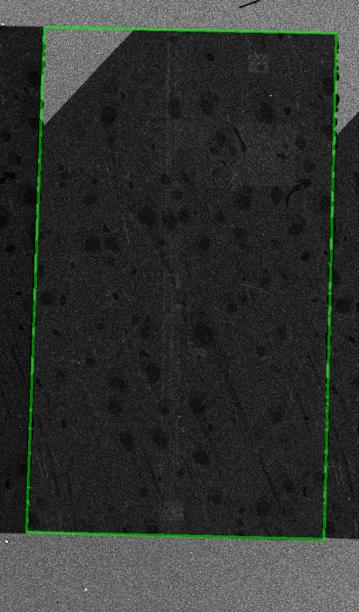
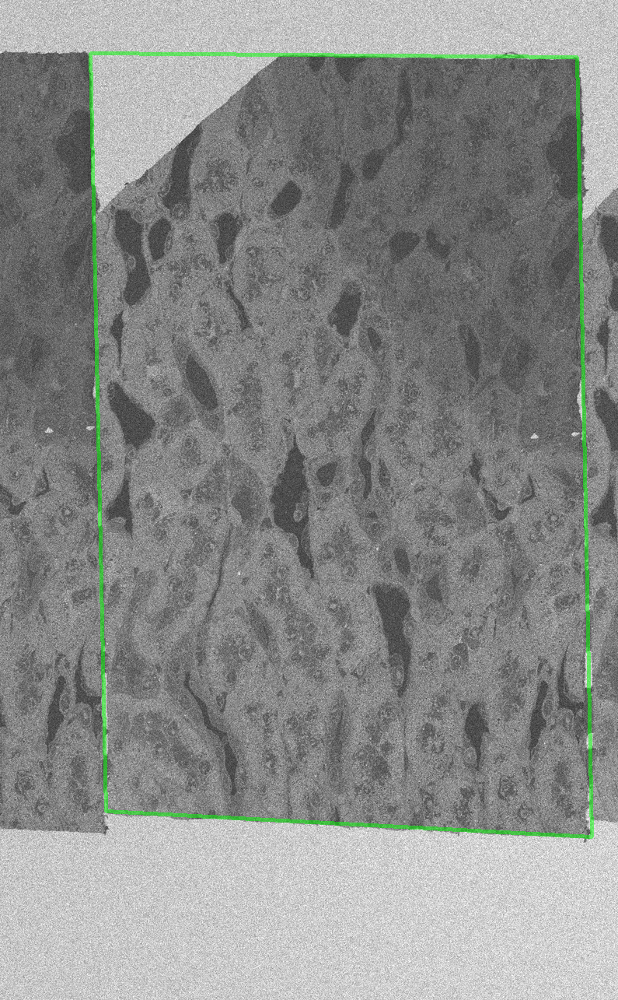
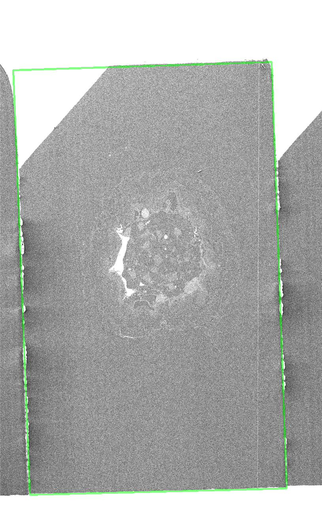

# Slice Recognition in Array Tomography

Cílem projektu bylo implementovat a otestovat algoritmus pro automatické
rozpoznávání řezů pro _Array Tomography_. Ideální algoritmus by měl být
robustní vůči rotaci řezů, šumu a jiným artefaktům. Výstupem projektu je
kromě samotné implementace také technická zpráva obsahující mimo jiné
průzkum stávajících metod a dostupných dat a popis zvoleného postupu.

## Použití prototype.ipynb

prototype.ipynb je prototypovací Jupyter notebook s funkční implementací
algoritmu a vizualizacemi jednotlivých kroků. Pro jeho spuštění jsou
zapotřebí externí Python knihovny. Seznam těchto knihoven a požadovaných
verzí je v souboru python_requirements.txt. Automatická instalace těchto
knihoven do uživatelova prostředí je možná pomocí nástroje pip:
`pip install -r python_requirements.txt`

## Překlad a použití C++ verze

C++ verze je implementována ve zdrojovém souboru `./bin/main.cpp` .
Její překlad na binární program lze spustit v adresáři `./bin/` příkazem make:

```
cd ./bin/
make
```

Bude přeložen cíl `slice_localize`, což je název výstupního binárního programu.
Výčet flagů a knihoven potřebných pro překlad se nachází v ./bin/Makefile a
funkčnost překladu a spuštění programu byly testovány na stroji merlin.

Kompilovaný program lze spustit s následujícími argumenty příkazové řádky:

- `--iterations` (nepovinný, výchozí hodnota: 1000) – Počet iterací pro hledání každé hrany RANSAC algoritmem.
- `--slopeFactor` (nepovinný, výchozí hodnota: 0.8) – Parametr α pro evaluaci fitness přímek.
- `--hugFactor` (nepovinný, výchozí hodnota: 0.8) – Parametr β pro evaluaci fitness přímek.
- `--seed` (nepovinný, výchozí hodnota: 42) – Seed pro generátor pseudo-náhodných čísel.
- `<path_in>` (povinný) – Cesta ke zdrojovému obrazu ve formátu .png.
- `<path_out>` (nepovinný) – Cesta k výstupnímu obrazu ve formátu .png. Budou zde vizualizovány nalezené hrany.

Příklad použití:
`./slice_localize --iterations 500 --slopeFactor 0.1 --seed 666 ./cesta/ke/vstupnimu/obrazku.png ./out_preview.png`

Program na standardní výstup vypíše souřadnice bodů výsledného polygonu, příklad výstupu:

```
96 86
337 83
337 672
61 673
```

## Použití evaluation.ipynb

evaluation.ipynb je Jupyter notebook se základní evaluací implementované metody.
Notebook ve stávající podobě při spuštění očekává:

- Kompilovaný program v cestě `../bin/slice_localize`
- Adresář s testovacími příklady řezů ve formátu png v adresáři `../data`
- Anotaci ground truth polygonů ve formátu VGG Image Annotator [1] v cestě `ground_truth_annotations.json`

Pro jeho spuštění jsou zapotřebí externí Python knihovny. Seznam těchto knihoven
a požadovaných verzí je v souboru python_requirements.txt. Automatická instalace
těchto knihoven do uživatelova prostředí je možná pomocí nástroje pip:
`pip install -r python_requirements.txt`

## Příklady výstupu

<p align="center">
  
  
  
</p>

[1] https://www.robots.ox.ac.uk/~vgg/software/via
